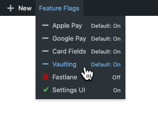

# WP Feature-Flags Manager

Small utility plugin to quickly toggle feature flags for WordPress plugin.


## Usage

While active, the plugin adds a new menu to the top admin-bar called "Feature Flags". That menu is the only UI of the plugin, and allows toggling feature flags on or off.

Feature flags are set via simple WP filters that return true or false. The filters are added during the `plugins_loaded` event - so basically, this plugin can change _any_ WP filter to return a boolean value.




## Installation

Run the `install.sh` script and define the target project as argument to install
this plugin into the relevant DDEV environment:

```sh
bash install.sh ~/Coding/wc-pp-plugin
```


## Configuration

To add or modify feature flags, edit the `config.php` file. This config-file must return a single array with a list of feature flags.

The initial configuration file contains feature flags for the WooCommerce PayPal Payments plugin.

To customize the configuration rules, copy the `config.php` file to `config.local.php` and modify its contents to your needs. The `.local.php` file is ignord by git, and not overwritten by future `git pull` actions.