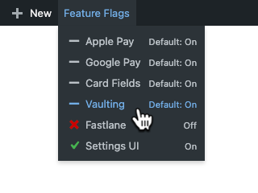

# WP Feature-Flags Manager

Small utility plugin to quickly toggle feature flags and run one-click actions for WordPress plugins via the admin bar.


## Usage

While active, the plugin adds two menus to the top admin bar:

**Feature Flags** - Toggle feature flags on or off. Feature flags are set via simple WP filters that return true or false. The filters are added during the `plugins_loaded` event, so this plugin can change _any_ WP filter to return a boolean value.

**Feature Actions** - Run predefined database operations with a single click. Each action executes a list of changes (set/delete options, fire action hooks). Useful for triggering migrations, resetting state, etc.




## Installation

Run the `install.sh` script and define the target project as argument to install
this plugin into the relevant DDEV environment:

```sh
bash install.sh ~/Coding/my-wp-project
```


## Project Structure

```
plugin.php                      # All plugin code — single file, namespace WpFeatureFlags
flags.php                       # Base feature flag definitions (PHP array)
actions.php                     # Base action definitions (PHP array)
*.sample.php                    # Templates copied to config dir on first load
install.sh                      # Deploys plugin to a target DDEV project
.github/workflows/release.yml  # Creates a GitHub release zip on semver tag push
adr/                            # Architecture Decision Records
```

Local config files live **outside** the plugin directory in `wp-content/wp-featureflags/` so they persist across plugin updates. On first load, `*.sample.php` templates are copied there as `*.php`:

```
wp-content/
  wp-featureflags/              # Persistent config dir — survives plugin updates
    flags.php                   # Local flag overrides (from flags.sample.php)
    actions.php                 # Local action overrides (from actions.sample.php)
    snippets.php                # Local PHP snippets (from snippets.sample.php)
  plugins/
    wp-featureflags/            # Plugin dir — replaced on update
      plugin.php
      flags.php                 # Base flag definitions
      actions.php               # Base action definitions
      *.sample.php              # Templates for the config dir
```


## Configuration

### Feature Flags

Edit `flags.php` to add or modify feature flags. The file must return an array of flag definitions:

```php
return [
    'my/flag' => [
        'label'   => 'My Feature',
        'filter'  => 'my_plugin_feature_enabled',
        'default' => true,       // optional: bool or callable
        'display' => true,       // optional: set to false to hide
    ],
];
```

### Feature Actions

Edit `actions.php` to define one-click actions. The file must return an array of action definitions:

```php
return [
    'my/action' => [
        'label'   => 'Reset Onboarding',
        'changes' => [
            ['set_option', 'option_name', $value],
            ['set_option_key', 'option_name', 'array_key', $value],
            ['delete_option', 'option_name'],
            ['do_action', 'my_hook_name', ...$args],
        ],
    ],
];
```

Supported change types:
- `['set_option', 'key', $value]` - Sets a WP option to the given value
- `['set_option_key', 'key', 'array_key', $value]` - Updates a single key within an array option
- `['delete_option', 'key']` - Deletes a WP option
- `['do_action', 'hook', ...$args]` - Fires a WordPress action hook with optional arguments

### Group headings and dividers

Both config files support visual group headings. A plain string entry or an entry with only a `label` key (no `filter`/`changes`) renders as a non-clickable separator in the dropdown menu. A dash-only string (e.g. `'-'` or `'---'`) renders as an `<hr>` divider line:

```php
return [
    'My Plugin',
    'myplugin/feature_x' => [
        'label'  => 'Feature X',
        'filter' => 'my_plugin_feature_x_enabled',
    ],
    '---',
    'Another Plugin',
    // ...
];
```

### Local overrides

Local config files live in `wp-content/wp-featureflags/`, outside the plugin directory, so they persist across plugin updates. On first load, the `*.sample.php` templates are copied there as starting points.

The shipped samples `require` the base definitions via `WP_FEATUREFLAGS_DIR` and `array_merge` on top, but you can return any array — merge, replace, or selectively `unset()` entries:

```php
// wp-content/wp-featureflags/flags.php (generated from flags.sample.php)
$my_flags = array();

return array_merge( (array) require WP_FEATUREFLAGS_DIR . '/flags.php', $my_flags );
```

### Snippets

The `snippets.php` file in the config dir (`wp-content/wp-featureflags/snippets.php`) is loaded on every request and can contain arbitrary PHP code — custom action handlers, debug helpers, etc. Like the other config files, it is seeded from `snippets.sample.php` on first load.
